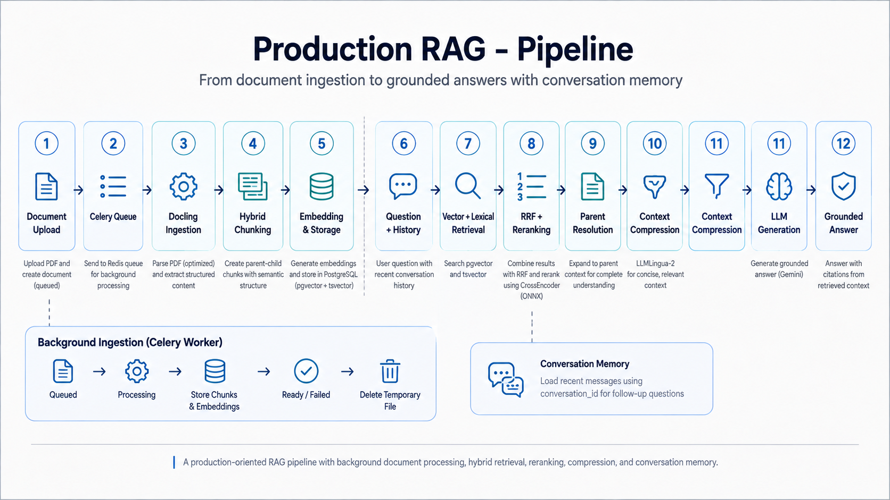
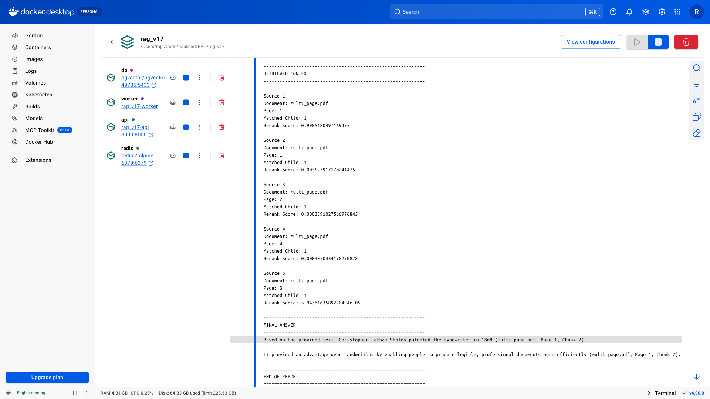
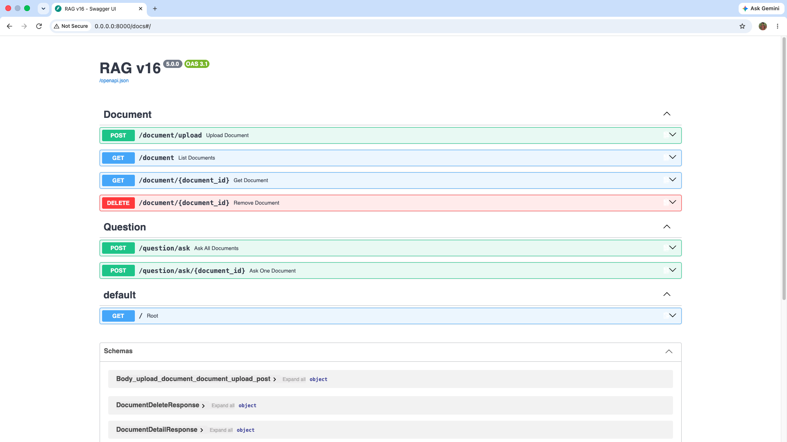

# GroundForge Production RAG

A production-oriented Retrieval-Augmented Generation backend for
uploading documents, processing them in the background, retrieving
relevant evidence, and generating grounded answers with conversation
context.

Documents are parsed and structured with Docling, stored as parent-child
chunks, and searched using both semantic and lexical retrieval.
Retrieved candidates are fused with Reciprocal Rank Fusion, reranked
with an ONNX CrossEncoder, resolved to their parent context, and passed
to the language model for answer generation. Document ingestion runs
separately through Celery and Redis so heavy PDF processing does not
block the API.

---

## Why this project

A useful RAG system needs more than accurate retrieval. It also needs
predictable latency, non-blocking document processing, strong context
selection, and an architecture that remains understandable as the
application grows.

### This project separates the two expensive paths:

Document ingestion runs in the background through Celery and
Redis. Upload requests can return without waiting for parsing,
chunking, embedding generation, and database storage.

Question answering stays focused on retrieval and generation,
using hybrid search, rank fusion, reranking, parent resolution, and
conversation-aware query preparation.

The result is a capable RAG backend that answers questions in below 5
seconds approximately, compared with 20--30 seconds in earlier
implementations, while document processing is handled independently in
the background.

The architecture is intentionally practical rather than over-scaled: it
keeps the important production boundaries---API, worker, broker,
database, retrieval, and generation---without adding infrastructure that
the current workload does not require.

---

## Skill Stack

{=html}
{=html}
{=html}
{=html}
{=html}
{=html}
{=html}
{=html}
{=html}
{=html}
{=html}
{=html}

---

## What It Includes

### 1. Structured document ingestion

PDFs are processed with Docling instead of basic text extraction.
The text-focused parsing configuration disables OCR, table processing,
page-image generation, and picture-image generation, while using the
PyPDFium2 backend.

### 2. Background document processing

Document ingestion is dispatched through Celery with Redis as
the broker. Parsing, chunking, embedding generation, and database
storage run in the worker instead of blocking the FastAPI request path.

queued → processing → ready
                    ↘ failed

Temporary uploaded files are cleaned up by the worker after processing.

### 3. Hybrid parent-child chunking

Docling's structured output is converted into parent and child chunks.
Small child chunks provide precise retrieval targets, while larger
parent chunks preserve enough surrounding context for answer generation.

### 4. Semantic + lexical retrieval

The retriever combines pgvector semantic similarity with PostgreSQL
tsvector full-text search, allowing evidence to be recovered by both
meaning and exact terminology.

### 5. Reciprocal Rank Fusion

Vector and lexical candidate lists are combined with Reciprocal Rank
Fusion (RRF) before reranking.

### 6. CrossEncoder reranking

Fused candidates are reranked using a CrossEncoder running through
an INT8 ONNX model on CPU. The reranker evaluates the question and
candidate text together before final context selection.

### 7. Parent resolution

The strongest child matches are resolved back to their parent chunks
before generation. This keeps retrieval precise while giving the
language model more complete evidence.

### 8. Conversation-aware query preparation

The application stores conversations using a conversation_id and loads
recent messages for follow-up questions. Query preparation turns
conversational questions into standalone retrieval queries while
producing alternative queries for candidate discovery.

### 9. Grounded answer generation

The final model receives the prepared question and retrieved parent
context, keeping generation tied to evidence recovered from uploaded
documents.

### 10. Retrieval evaluation

The pipeline has been evaluated with Recall@K, MRR, context precision,
context recall, faithfulness, and groundedness checks, making
retrieval quality measurable rather than relying only on manual
impressions.

---

## Workflow

The workflow separates background ingestion from the question-answering
path. Documents are prepared asynchronously, while retrieval and
generation remain focused on answering questions from indexed content.

## Example Report

The application runs as separate Docker services for the API, Celery
worker, Redis broker, and PostgreSQL database.

## Preview

FastAPI exposes the document and question workflows through an
interactive API interface.

---

## Performance

The final pipeline was optimized around bottlenecks observed during
development rather than theoretical high-scale traffic.

Operation             Earlier implementations          Current pipeline

Question answering                   20--30 s               below 5 s
approximately

Application startup                       2 m                ~30 s

### Startup

Application startup takes approximately 30 seconds while FastAPI
initializes the CrossEncoder reranker and the Celery worker
initializes Docling.

### Document processing

A document takes approximately 3 seconds to complete the background
ingestion path:

Docling parsing
    ↓
chunking
    ↓
embedding generation
    ↓
database storage

Because this work runs through Celery, the API does not keep the upload
request waiting for the full ingestion pipeline.

### Question answering

The complete question path---including query preparation, hybrid
retrieval, RRF fusion, ONNX CrossEncoder reranking, parent resolution,
and final answer generation---runs in below 5 seconds approximately
in the measured setup.

Earlier implementations required at least 20--30 seconds for the
same overall question-answering workflow.

Performance figures are measurements from the development environment
and should be treated as approximate rather than universal production
guarantees.

---

## Running the Project

### 1. Clone the repository

git clone <your-repository-url>
cd <repository-name>

### 2. Configure the environment

Create a .env file with the database configuration and model/API
credentials expected by the application.

### 3. Build and start the services

docker compose up --build

This starts FastAPI, PostgreSQL + pgvector, Redis, and the Celery
worker. The first startup can take around 30 seconds while Docling and
the CrossEncoder initialize.

### 4. Run database migrations

docker compose exec api alembic upgrade head

### 5. Open Swagger UI

http://localhost:<PORT>/docs

### 6. Upload a document

Upload a PDF through the document endpoint. The API creates the document
record and dispatches the ingestion work to the Celery worker.

### 7. Ask questions

Once the document is ready, use the question endpoint to retrieve
evidence and generate grounded answers. Continue with the same
conversation_id for follow-up questions that require recent
conversation context.

---

## Final Note

This project is a complete production-oriented RAG backend built around
strong retrieval, controlled context construction, background document
processing, and measurable performance.

Its architecture keeps document ingestion away from the request path,
combines semantic and lexical retrieval, reranks candidates before
generation, preserves useful parent context, and supports stateful
conversations. In the measured development environment, background
document processing completes in approximately 3 seconds, while the
full question-answering path completes in below 5 seconds
approximately.

The system is intentionally kept within the scale it currently needs. It
has clear service boundaries and enough capability to operate as a
standalone RAG backend today, while also being suitable to expose later
as a retrieval tool inside larger agentic applications.